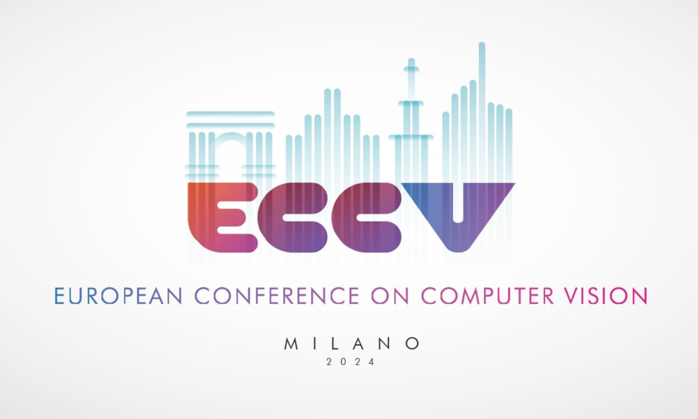

---
# Feel free to add content and custom Front Matter to this file.
# To modify the layout, see https://jekyllrb.com/docs/themes/#overriding-theme-defaults

layout: home
---

# ECCV 2024, Milano

When: 29 September 2024 - 04 October 2024

Location: [MiCo Milano](https://www.micomilano.it) 

# Dates

| Friday, September 15, 2023  | Area chair/Reviewer selection opens |
| Thursday, February 29, 2024  |	Abstract registration deadline |
| Thursday, March 7, 2024  |	Submission deadline |
| Thursday, March 14, 2024  | Supplementary materials deadline |
| Monday, April 1, 2024  | Review period starts |
| Friday, April 26, 2024  | Reviews due |
| Thursday, May 9, 2024	 | Reviews released to authors |
| Friday, May 17, 2024  | Rebuttal deadline (8 days) |
| Monday, May 27, 2024  | Final reviewer recommendations due |
| Sunday, June 23, 2024  | Area chair recommendations due |
| Monday, July 1, 2024  | Decisions communicated to authors |
| Monday, July 15, 2024  | Camera ready deadline |
| Sunday, September 29, 2024	| Conference begins |

<u>Note:</u> All deadlines are at 13:00 PST (to ensure faster CMT support). These dates, as well as the internal dates for reviewers and ACs, can be viewed <a href="https://tinyurl.com/eccv2024calendarview">here</a>. You can add these to your calendar (on <a href="https://tinyurl.com/eccv2024calendar">Google calendar</a> or <a href="https://calendar.google.com/calendar/ical/afa2ed37f3e8d2f2bd4002b5a03aa5845b14398205f7a593e05f9c8e0e8d59a5%40group.calendar.google.com/public/basic.ics">iCal format</a>).

# People

| General chairs | Laura Leal-Taixe, Vittorio Murino, Andrew Fitzgibbon |
| Program chairs | Ales Leonardis, Elisa Ricci, Stefan Roth, Olga Russakovsky, Torsten Sattler, Gul Varol |

## Area chairs and reviewers

We encourage reviewers and area chairs to self-nominate.  If you know of someone who would be a great reviewer or AC, encourage them to self-nominate.

  - Area Chair nomination: [google form](https://forms.gle/VkgbRU573wVLtgLq5)
  - Reviewer nomination: [google form](https://forms.gle/cuY6oiBv8JTjvRQ59)